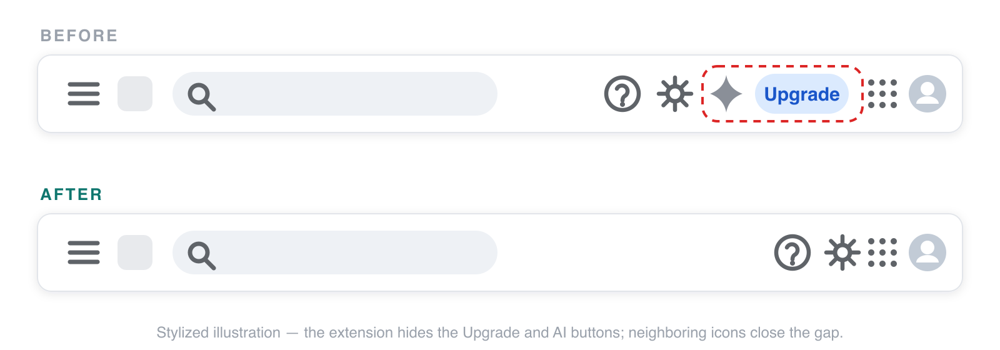

# Hide Upgrade Button for Gmail, Drive & Docs

A tiny browser extension (Manifest V3) that hides the **Upgrade** and **Ask Gemini** buttons in the headers of Gmail, Google Drive, and Google Docs, plus the **Upgrade** button in Google Calendar. No analytics, no network requests, no data collection — it does one thing.



## What it does

- Hides the **Upgrade** upsell button and the **Ask Gemini** button — each behind its own toggle in the popup, both on by default.
- Works across **Gmail, Google Drive and Google Docs** (Docs/Sheets/Slides editors and their home screens), with optional access to **Google Calendar**.
- Hides **before the first paint**: a stylesheet applied at `document_start` plus a mutation watcher keep the buttons from ever flashing, and keep them hidden through Google's dynamic re-renders and SPA navigation.
- Neighboring header icons **shift to fill the space** — no empty gap is left behind.
- Applies to **already open tabs** right after install, no reload needed.
- Toggling a setting applies **live** to every open tab.

## How it stays safe

Google's markup is obfuscated and changes often, so the extension never relies on CSS class names. It identifies the buttons by stable semantics (accessible labels, roles, header scope) and by locale-independent structural signals. When a match is ambiguous, it **does nothing** rather than hide the wrong thing. If Google changes the markup beyond recognition, the worst case is that the buttons come back — nothing breaks. When that happens, hiding will be restored by an extension update; the popup links to the [issue tracker](https://github.com/maximtop/hide-gmail-upgrade-button/issues) so reappearing buttons get noticed quickly.

## Install

Install the extension from the [Chrome Web Store](https://chromewebstore.google.com/detail/hide-upgrade-button-for-g/flakajdfnklpgiefoffmecgbfbckmpcb) or from [Microsoft Edge Add-ons](https://microsoftedge.microsoft.com/addons/detail/hide-upgrade-button-for-g/oifpjlhikjiifjlcihandpghdiechhik).

The Firefox Add-ons listing is on the way. For local development, install from source:

```bash
make install
make dev chrome
```

Then open `chrome://extensions`, enable **Developer mode**, click **Load unpacked** and pick `build/dev/chrome/`. See [DEVELOPMENT.md](DEVELOPMENT.md) for Firefox/Edge and all other commands.

## Permissions

| Permission | Why |
| --- | --- |
| `storage` | Persist the two toggles locally |
| `scripting` | Apply the extension to supported tabs that were already open when access was granted |
| `mail.google.com`, `drive.google.com`, `docs.google.com` | Required access for the extension's original supported sites |
| `calendar.google.com` (optional) | Works automatically after you enable Calendar once in the popup |

Nothing else. The extension makes no network requests and collects no data of any kind — see the [privacy policy](PRIVACY.md).

## Remove

`chrome://extensions` (or `edge://extensions` in Edge, `about:addons` in Firefox) → find *Hide Upgrade Button for Gmail, Drive & Docs* → **Remove**. The extension stores only its two toggle values, which are deleted together with it. Reload open supported tabs to bring the hidden buttons back instantly (they also reappear on the next natural page re-render).

## Support & contributing

- Bugs and ideas: [GitHub issues](https://github.com/maximtop/hide-gmail-upgrade-button/issues). If a button stopped being hidden, Google likely changed the markup — please attach the button's `outerHTML` if you can.
- PRs are welcome: read [AGENTS.md](AGENTS.md) for conventions and run `pnpm validate` before submitting.

## License

[MIT](LICENSE). This project is not affiliated with, endorsed by, or sponsored by Google. Gmail, Google Drive, Google Docs, Google Calendar and Gemini are trademarks of Google LLC, referenced only to describe compatibility.
